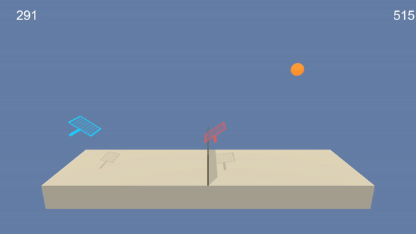

# RL-MultiAgent

## Introduction

This project is part of the Udacity Nanodegree on Reinforcement Learning and aims at training two agents to play tennis.

Description:

- Reward: +0.1 if the agent hits the ball over the net, -0.01 if the agent lets the ball hit the ground or hits the ball out of bounds. The more the ball stay in game the more the reward.
- Observation Space: 8 variables corresponding to the position and velocity of the ball and racket. Each agent receives its own local observation of the space
- Action State: 2-dimensional continuous space corresponding to jumping and movement toward (or away) from the net.

The task is episodic and considered solved when the agents get an average reward of +0.5 over 100 consecutives episodes.

## Installation

Follow the instructions on this [repo](https://github.com/udacity/deep-reinforcement-learning#dependencies) to install all the dependencies Note that if you are running the code on Windows you might have trouble installing the box2d environnement you can solve this issue by using `pip install box2d` instead of `pip install gym[box2d]`.

Then follow the instructions on this [section](https://github.com/udacity/deep-reinforcement-learning/tree/master/p3_collab-compet).

## Method

## What contains this repository ? 
